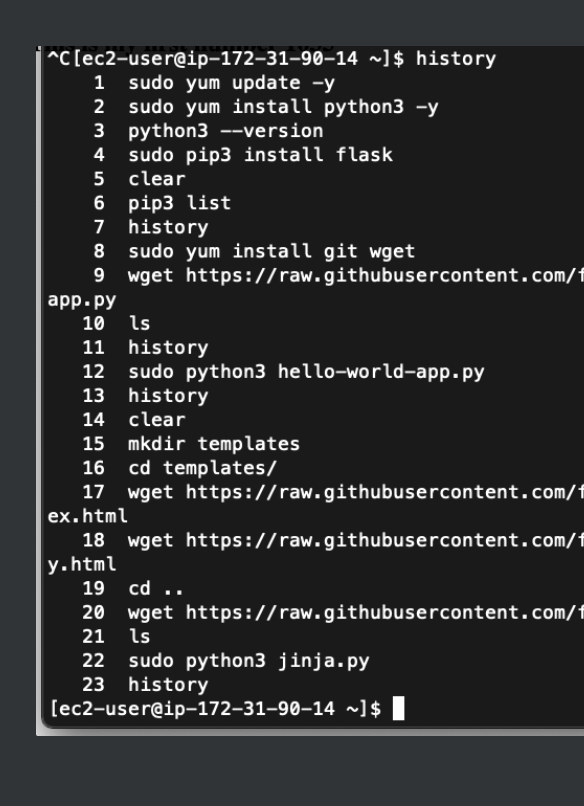

```
    1  exit
    2  sudo yum update -y
    3  sudo yum install python3 -y
    4  python3 --version
    5  sudo pip3 install flask
    6  pip3 list
    7  sudo yum install git wget
    8  wget https://raw....
    9  ls
   10  sudo vi hello-world-app.py
   11  sudo python3 hello-world-app.py
   12  mkdir templates
   13  cd templates
   14  wget https://raw...
   15  wget https://raw...
   16  ls
   17  cd ..
   18  wget https://raw...
   19  ls
   20  sudo python3 jinja.py
   21  history
```