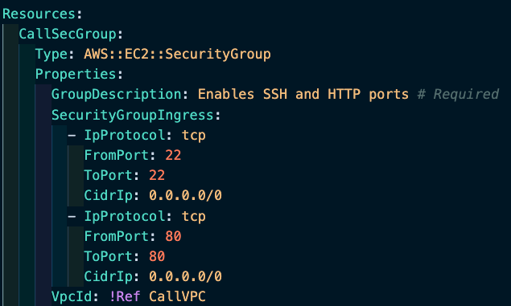

## This template will create Application Load Balancer with ASG and LT.


```
- write `cfn` and select `cfn-lite` 
- Delete `parameters`
- Delete `outputs`
- `|` pipe (near Descriptions) let me write multiple lines
- Write a description under `Description` title ==> (This template will create Application Load Balancer with ASG and LT.)
```

```
- `Resources:` ==> go under resources
- write `secgr` within list select `ec2-securitygroup`
- `LogicalID` it is like a variable and change it as `CallSecGroup` 
- keep the `Type` ==> every resources has a type
- `GroupDescription:` write what secgroup does ==> 'Enables SSH and HTTP ports` # Required  
- Delete `GroupName` # not required
- Delete `SecurityGroupEgress` ==> outbound group (*security groups are stateful)
- `SecurityGroupIngress` add rules under it list of rules to that..
- under `SecurityGroupIngress` write ingress(a list will popup) and select `security-group-ingress-cidr` 
- For `IpProtocol` select `tcp`
- `FromPORT: 22`
- `ToPort: 22`
- `CidrIp: 0.0.0.0/0`
- `IpProtocol: tcp`
- `FromPORT: 80`
- `ToPort: 80`
- `CidrIp: 0.0.0.0/0` 
- Delete `Tags` 
- `VpcId` it will be added `!Ref CallVP`(not this stage will come back here later)
```


* [Security groups are stateful](https://docs.aws.amazon.com/vpc/latest/userguide/VPC_SecurityGroups.html)—if you send a request from your instance, the response traffic for that request is allowed to flow in regardless of the inbound rules. This also means that responses to allowed inbound traffic are allowed to flow out, regardless of the outbound rules.