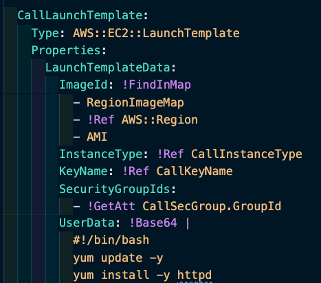

# This template will create Application Load Balancer with ASG and LT.


[WHOLE YAML FILE FOR THIS PROJECT](./alb-asg-cfn.yaml)


```
- write `cfn` and select `cfn-lite` 
- Delete `parameters`
- Delete `outputs`
- `|` pipe (near Descriptions) let me write multiple lines
- Write a description under `Description` title ==> (This template will create Application Load Balancer with ASG and LT.)
```

```
- `Resources:` ==> go under resources
- write `secgr` within list select `ec2-securitygroup`
- `LogicalID` it is like a variable and change it as `CallSecGroup` 
- keep the `Type` ==> every resources has a type
- `GroupDescription:` write what secgroup does ==> 'Enables SSH and HTTP ports` # Required  
- Delete `GroupName` # not required
- Delete `SecurityGroupEgress` ==> outbound group (*security groups are stateful)
- `SecurityGroupIngress` add rules under it list of rules to that..
- under `SecurityGroupIngress` write ingress(a list will popup) and select `security-group-ingress-cidr` 
- For `IpProtocol` select `tcp`
- `FromPORT: 22`
- `ToPort: 22`
- `CidrIp: 0.0.0.0/0`
- `IpProtocol: tcp`
- `FromPORT: 80`
- `ToPort: 80`
- `CidrIp: 0.0.0.0/0` 
- Delete `Tags` 
- `VpcId !Ref CallVPC` ==> we need to define VPC and call it with !Ref*  
```


```
- under `Resources` write `target` (list popup) select `elasticloadbalancingv2-target..`
- rename `LogicalId` as `CallAlBTargetGroup`
- `Type: AWS::ElasticLoadBalancingV2::TargetGroup`
- `Properties:`
- `HealthCheckIntervalSeconds: 25`
- `HealthCheckTimeoutSeconds: 4`
- `HealthyThresholdCount: 3`
- `Port: 80`
- `Protocol: HTTP`
- `TargetType: instance`
- `UnhealthyThresholdCount: 3`
- `VpcId: !Ref CallVPC` ==> we need to define VPC and call it with !Ref*
- DELETE all other lines under `CallAlBTargetGroup` <==(LogicalId)
```

```
- Go top under `Description:` 
- write `Parameters:`
- write `para` under `Parameters` (list popup) select `parameter-type-vpc-id` 
- rename `ParameterName` variable as `CallVPC`
- define `Description:`=> `Select the VPC for your application from the list.`
- keep `Type` as is. 
- Delete `Default`
```

```
- go under `CallAlBTargetGroup`
- write `elasticload` (list popup) select `elasticloadbalancingv2-loadbal...` enter
- rename `LogicalId` as `CallApplicationLoadBalancer:`
- keep `Type:` under `CallApplicationLoadBalancer:` as is
- keep the 'Type' bottom  and rename `String` as `application`
- keep `Properties`
- under `Properties` I defined SecurityGroups before and I need `IDs` of security group*   
- `!GetAtt CallSecGroup.GroupId` previously defined `CallSecGroup` and attribute `GroupId` 
- keep `Subnets:' and Go Top Under `Parameters` define subnet lists and we will use `!Ref CallSubnets` here. 
- DELETE all other lines under `CallApplicationLoadBalancer:` <==(LogicalId)
```

```
- under Parameters write `para` (list pop) we need more than one subnet therefore we will select `parameter-type-subnet-id-list` List means we can select more than one.
- rename `paramName` variable as `CallSubnets:`
- keep `Description` write `Please select at least two of the subnets from the list.`
- keep 'Type` as is
- Delete `Default`
```


```
- go under `CallApplicationLoadBalancer:`
- write `listener` (list popup) select `AWS::ElasticLoadBalancingV2::Listener`.
- rename `LogicalId` as `CallALBListener:`
- keep `Type` as is
- keep `Properties`
- DefaultActions: # Required (list of actions)
        - Type: forward # to TargetGroupArn 
          TargetGroupArn: !Ref CallAlBTargetGroup *   
      LoadBalancerArn: !Ref CallApplicationLoadBalancer * # Required
      Port: 80
      Protocol: HTTP
- DELETE all other lines
```

```
- go under `CallALBListener`
- write `launchtem` (list popup) select `ec2-launchtemplate`
- rename `LogicalId` as `CallLaunchTemplate:`
- keep `Type` as is
- keep `Properties`
- keep `ImageId` !FindInMap(it will be used mapping section go top under parameters section here we are using !FindInMap Function)
	- RegionImageMap ==> (name of the map)
    - !Ref AWS::Region
    - AMI
- keep `InstanceType`==> `!Ref CallInstanceType`(to give ref first we need to create instance type parameter, check below)
- keep `KeyName` `!Ref CallKeyName` (to give ref we need to create KeyName parameter, check below)
- keep `SecurityGroupIds:` 
	  - !GetAtt CallSecGroup.GroupId (getting attribute)
- keep `UserData:` ==> !Base64 (Intrinsic function)*==> it is not encryption it is just encoding(convention)mainly transfer between servers.(write your bash script here under Base64)
- DELETE all other lines
```

```
- go top under parameters section 
- write `Mappings:`
- under `Mappings` copy and past RegionImageMap: values (self created part)
```

```
- go top under parameters section 
- write 'par` (list popup) select `parameter-type-keypair-keyname'
- rename `ParaMeterName` as `CallKeyName:`
- `Description: Select your key pair from the list`
- keep `Type` as is 
- Delete 'Default`
```

```
- go top under parameters section 
- write 'par` (list popup) select `parameter'
- rename `ParaMeterName` as `CallInstanceType:`
- `Description: Select the instance type for your web server.`
- keep `Type` as is 
- keep 'Default: t2.micro`
- write `AllowedValues:` ==> (write list of instance as below)
  - t2.micro
  - t3.micro
  - t3a.micro
  - t3.nano
  - t2.nano
```

```
- go under `CallLaunchTemplate` section
- write `autos` (list popup) select `autoscalling-autoscalingroup`
- rename `LogicalId` as `CallAutoScalingGroup:`
- Type: AWS::AutoScaling::AutoScalingGroup (keep below part as written)
    Properties:
      AvailabilityZones: !GetAZs (use GetAZs function check below)
      DesiredCapacity: "2"
      HealthCheckGracePeriod: 90
      HealthCheckType: ELB
      LaunchTemplate:
        LaunchTemplateId: !Ref CallLaunchTemplate
        Version: "1"
      MaxSize: "3" # Required
      MinSize: "1" # Required
      TargetGroupARNs:
        - !Ref CallAlBTargetGroup 
- DELETE all other lines
```

```
- policy section
- write `autosa` (list popup) select `autoscalling-scalinpolicy`
- rename `LogicalId` as `CallCPUPolicy:`
- Type: AWS::AutoScaling::ScalingPolicy
- Properties:
    AutoScalingGroupName: !Ref CallAutoScalingGroup (Ref ASG) # Required
    PolicyType: TargetTrackingScaling
    TargetTrackingConfiguration:
      PredefinedMetricSpecification:
          PredefinedMetricType: ASGAverageCPUUtilization (write here `pr` list popup and select `PredefinedMetricSpecification` and write `ASGAverageCPUUtilization`)
      TargetValue: 40.0
- DELETE all other lines
```

```
- last part is `Outputs`
- write `Outputs:`
- write again `output`and (list popup) select `Outputs`
- rename `LogicalId` as `AppURL:` 
- `Description: URL of Calls App`
- keep `Value` and delete other lines then write another function `!Join` then write below lines,
      - "" ==> (delimeter)
      - - "http://" 
        - !GetAtt CallApplicationLoadBalancer.DNSName ==> (get DNSName of load balancer) 
```

## TEMPLATE IS READY FOR CLOUDFORMATION 
[CLICK HERE](./alb-asg-cfn.yaml) 


<br>
<br>
--------------------------------------------------------------------------------

* [Security groups are stateful](https://docs.aws.amazon.com/vpc/latest/userguide/VPC_SecurityGroups.html)—if you send a request from your instance, the response traffic for that request is allowed to flow in regardless of the inbound rules. This also means that responses to allowed inbound traffic are allowed to flow out, regardless of the outbound rules.

* VPC ==> All our resources should be under same VPC you need to define VPC id here. Then, resources (secgroup, targetgroup) can talk each other.  

*  `CallApplicationLoadBalancer's` securityGroups IDs 

*  `!GetAtt` function

* 

* [AWS ARN](https://docs.aws.amazon.com/general/latest/gr/aws-arns-and-namespaces.html)
Amazon Resource Names (ARNs) uniquely identify AWS resources. We require an ARN when you need to specify a resource unambiguously across all of AWS, such as in IAM policies, Amazon Relational Database Service (Amazon RDS) tags, and API calls.

* An Amazon Resource Name (ARN) is a file naming convention used to identify a particular resource in the Amazon Web Services (AWS) public cloud. ARNs, which are specific to AWS, help an administrator track and use AWS items and policies across AWS products and API calls.

[Fn::Base64](https://docs.aws.amazon.com/AWSCloudFormation/latest/UserGuide/intrinsic-function-reference-base64.html)
The intrinsic function Fn::Base64 returns the Base64 representation of the input string. This function is typically used to pass encoded data to Amazon EC2 instances by way of the UserData property.

[Fn::FindInMap](https://docs.aws.amazon.com/AWSCloudFormation/latest/UserGuide/intrinsic-function-reference-findinmap.html) The intrinsic function Fn::FindInMap returns the value corresponding to keys in a two-level map that is declared in the Mappings section.

[Health checks for Auto Scaling instances](https://docs.aws.amazon.com/autoscaling/ec2/userguide/healthcheck.html) Health checks provided by Elastic Load Balancing (ELB). These health checks are disabled by default but can be enabled.


[Fn::GetAZs](https://docs.aws.amazon.com/AWSCloudFormation/latest/UserGuide/intrinsic-function-reference-getavailabilityzones.html)
- Return value ==≥ 
The list of Availability Zones for the region.
<br>
<br>


